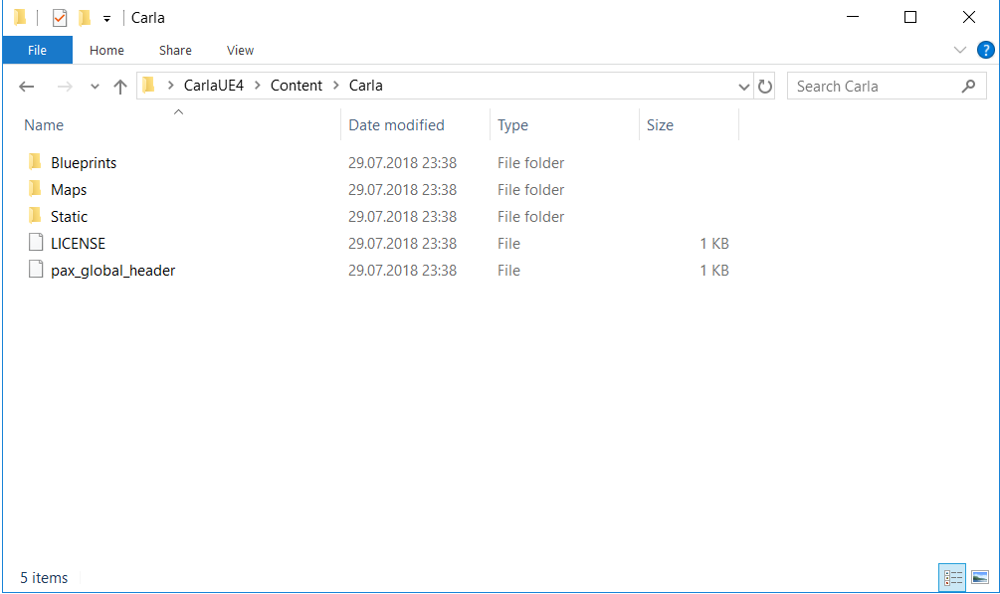

# UnrealCV
This is a customized version of the original [UnrealCV project](https://unrealcv.org). It is used to render RGB images, depth images as well as other kind of images from an Unreal 3D model. We used it to render rolling shutter images for our "Deep Shutter Unrolling Network" paper, which will be published in CVPR 2020. If you find our code is useful, please consider citing our paper as well as the original paper describing [UnrealCV](https://unrealcv.org).

```
@inproceedings{Liu2020CVPR,
  author = {Peidong Liu and Zhaopeng Cui and Viktor Larsson and Marc Pollefeys},
  title = {Deep Shutter Unrolling Network},
  booktitle = {IEEE Conference on Computer Vision and Pattern Recognition},
  year = {2020}
}
```

## Requirements
* Windows 10 
* Download and install Visual studio community 2017 from [here](https://visualstudio.microsoft.com/vs/older-downloads/).
* Download and install Unreal game engine 4.22.3 from [here](https://www.unrealengine.com/en-US/get-now).

## Installation
In order to render images via UnrealCV, you need to have an Unreal 3D model. The model can be obtained from [Unreal market place](https://www.unrealengine.com/marketplace/en-US/store). For your convenience, we provide a [3D model](https://github.com/ethliup/CarlaUE4) from the [Carla simulator](http://carla.org) and make it compatiable with our customized UnrealCV. We use CarlaUE4 model as an example for the rest of the instructions.

* Download the CarlaUE4 project via following command
```
git clone https://github.com/ethliup/CarlaUE4
```
* Download Carla scene models from [Google drive](https://drive.google.com/open?id=1joNIdwcMGAIDyH-pIQcstARiL6F5tAGt) and extract it to ./CarlaUE4/Content/Carla directory. We use this model to render our rolling shutter image dataset for our CVPR2020 paper on "Deep Shutter Unrolling Network".
```
cd CarlaUE4
mkdir Content
mkdir Content/Carla
```
The resulting directory would have following content:



* Download our customized UnrealCV code to "Plugins" directory
```
cd CarlaUE4
mkdir Plugins && cd Plugins
git clone https://github.com/ethliup/UnrealCV
```

* Go back to project root directory and double click "CarlaUE4.uproject" file. UnrealCV will be promoted to ask for compilation. Choose to build it.

## Configurations 
In order to properly use Unreal game engine editor to navigate the 3D models and render images, we need to configure the Unreal game engine editor.

* Double click "CarlaUE4.uproject" file to invoke the CarlaUE4 Editor.

* Set up the game mode from the CarlaUE4 Editor
```
Go to "Eidt->Project Settings->Project->Maps & Modes", select "UE4CVGameMode" as default gamemode.

Go to "Window->World Settings->Game Mode", select "UE4CVGameMode" as GameMode Override
```

* Set up axis mappings, go to "Edit->Project Settings->Engine->Input->Axis Mappings"
```
Add "Pitch", choose Mouse-Y
Add "Yaw", choose Mouse-X
Add "MoveForward", choose W (+1) & S (-1)
Add "MoveRight", choose A (-1) & D (+1)
Add "MoveUpward", choose Q (+1) & E (-1)
```

## Instructions to render images via provided script
Now you can render rolling shutter images or other kind of images via our provided python script. You need to tell Unreal Editor to load which Carla town for data rendering. For example, you can load Town01 from "Content Browser: Content/Carla/Maps". Double click Town01 from the map list and wait for the Editor to load the model correctly. Then you should start the Unreal game engine by clicking the "Play" button from the Unreal editor. Now you can invoke following example script for data rendering.

```
cd CarlaUE4/Plugins/UnrealCV/Python
python capture_rolling_shutter.py
```

For your convenience, we also provide a list of sampled positions for each town. We use it to render rolling shutter images for our CVPR-2020 paper. The file can be found from "CarlaUE4/Carla_town_sampled_position.zip". Extract it and provide the absolute path to "capture_rolling_shutter.py" for data rendering.

## Useful commands
You can refer to "Source/UnrealCV/Private/UE4CVCommandHandlers.cpp" for a detailed list of commands, which might be useful for your own purpose. For example, you can navigate the camera within the Unreal Editor by using the configured keys "A,D,W,S,Q,E" for 3-axis translations and using your mouse for rotations. Once you arrived at a preferred position, you can invoke following commands to get its current precise position within the 3D model.
```
vget /pose
```
The commands can be typed in from the "World/Developer Tools/Output Log". Once you click it, there will have a Cmd terminal at the bottom of the Editor. 
